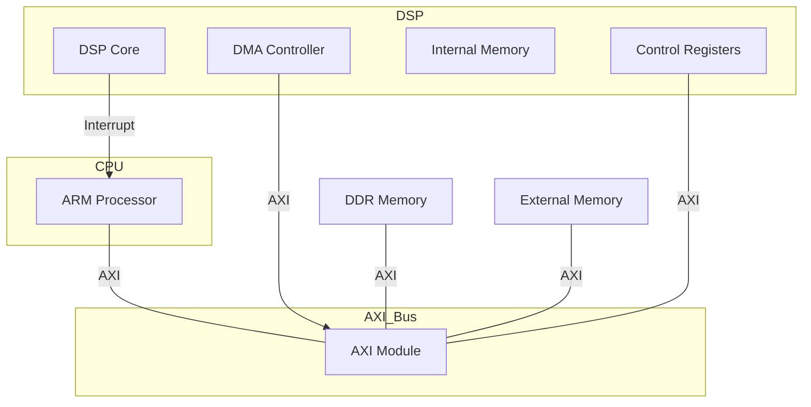

# chip-design-and-code-demo



```asm
.section .vectors, "a", %progbits
.global _vector_table
_vector_table:
    .word _stack_top             /* Top of stack (end of RAM) */
    .word _start                 /* Reset vector, entry point */
    .word interrupt_handler      /* IRQ vector */

.section .text
.global _start
.global interrupt_handler

/* Стартовая точка программы */
_start:
    MOV SP, #0x8000                    ; Setup stack pointer
    BL setup                           ; Call setup function

main_loop:
    BL process_commands                ; Call DSP command processing function
    B wait_flag                        ; Jump to wait for DSP processing completion

wait_flag:
    LDR R1, =PROCESSING_FLAG
    LDR R1, [R1]                       ; Load processing flag status
    CMP R1, #0                         ; Check if the flag is reset
    BNE wait_flag                      ; Continue waiting if flag is not reset
    B main_loop                        ; Return to the start of the main loop

setup:
    LDR R0, =DSP_CONTROL_REG_ADDR
    LDR R1, =DSP_STATUS_REG_ADDR
    LDR R2, =DSP_DATA_REG1_ADDR
    LDR R3, =DSP_DATA_REG2_ADDR
    MOV LR, PC                         ; Save return address
    BX LR                              ; Return from setup function

process_commands:
    LDR R4, =PRELOAD_DATA1
    LDR R5, =PRELOAD_DATA2
    LDR R4, [R4]                       ; Load first set of data
    LDR R5, [R5]                       ; Load second set of data
    STR R4, [R2]                       ; Store first data to DSP
    STR R5, [R3]                       ; Store second data to DSP
    MOV R6, #1                         ; Command to start DSP
    STR R6, [R0]                       ; Write command to DSP control register
    LDR R1, =PROCESSING_FLAG
    MOV R2, #1
    STR R2, [R1]                       ; Set processing flag
    MOV LR, PC                         ; Save return address
    BX LR                              ; Return from function

/* Обработчик прерываний */
interrupt_handler:
    PUSH {R0-R12, LR}                  ; Save context of registers
    LDR R0, =DSP_STATUS_REG_ADDR
    LDR R0, [R0]                       ; Read DSP status
    LDR R1, =PROCESSING_FLAG
    MOV R2, #0
    STR R2, [R1]                       ; Reset processing flag
    LDR R1, =DSP_DATA_REG1_ADDR
    LDR R2, =EXT_MEMORY_BASE_ADDR
    LDR R3, =RESULT_OFFSET
    LDR R1, [R1]                       ; Read result from DSP
    STR R1, [R2, R3]                   ; Write result to external memory
    POP {R0-R12, LR}                   ; Restore context
    MOVS PC, LR                        ; Return from interrupt

/* Данные и константы */
.section .data
DSP_CONTROL_REG_ADDR: .word 0x40000000
DSP_STATUS_REG_ADDR:  .word 0x40000004
DSP_DATA_REG1_ADDR:   .word 0x40000008
DSP_DATA_REG2_ADDR:   .word 0x4000000C
EXT_MEMORY_BASE_ADDR: .word 0x70000000
RESULT_OFFSET:        .word 0x00000020
PRELOAD_DATA1:        .word 0x12345678
PRELOAD_DATA2:        .word 0x87654321
PROCESSING_FLAG:      .word 0
```

## Linker script
```ld
/* Linker script for an ARM Cortex-M microcontroller */
MEMORY
{
    FLASH (rx)  : ORIGIN = 0x08000000, LENGTH = 256K  /* Adjust the flash size and origin as per the specific MCU */
    RAM (rwx)   : ORIGIN = 0x20000000, LENGTH = 64K   /* Adjust the RAM size and origin as per the specific MCU */
}

/* Define entry point and stack top */
ENTRY(_start)
_estack = ORIGIN(RAM) + LENGTH(RAM);  /* Define the top of stack at the end of RAM */

SECTIONS
{
    /* Place the vector table at the start of FLASH */
    .isr_vector :
    {
        . = ALIGN(4);
        KEEP(*(.vectors))  /* Keep the vector table at the very beginning */
        . = ALIGN(4);
    } > FLASH

    /* Program code and constant data */
    .text :
    {
        . = ALIGN(4);
        *(.text)  /* All text sections from all files */
        *(.rodata)  /* Read-only data (constant) */
        . = ALIGN(4);
    } > FLASH

    /* Initialized data sections to be copied to RAM on startup */
    .data :
    {
        . = ALIGN(4);
        _sdata = .;  /* Create a symbol at the start of the .data section */
        *(.data)  /* All data sections from all files */
        . = ALIGN(4);
        _edata = .;  /* Define a symbol at the end of the .data section */
    } > RAM AT> FLASH

    /* Uninitialized data section */
    .bss :
    {
        . = ALIGN(4);
        _sbss = .;  /* Symbol at the start of the .bss section */
        *(.bss)
        . = ALIGN(4);
        _ebss = .;  /* Symbol at the end of the .bss section */
    } > RAM

    /* Additional sections */
    .heap (NOLOAD) :
    {
        . = ALIGN(4);
        _sheap = .;  /* Start of heap */
        . = ALIGN(4);
        _eheap = ORIGIN(RAM) + LENGTH(RAM);  /* Set end of heap at end of RAM */
    } > RAM

    .stack (NOLOAD) :
    {
        . = ALIGN(8);
        . = . + 0x1000;  /* Example stack size 4K */
        . = ALIGN(4);
        _estack = .;  /* End of stack */
    } > RAM

    /* Ensure the stack does not overlap with heap or other data */
    ASSERT(_eheap <= _estack, "Heap and stack collision")
}
```


